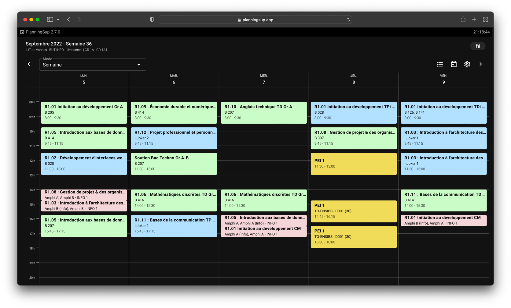
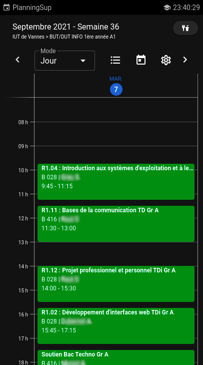
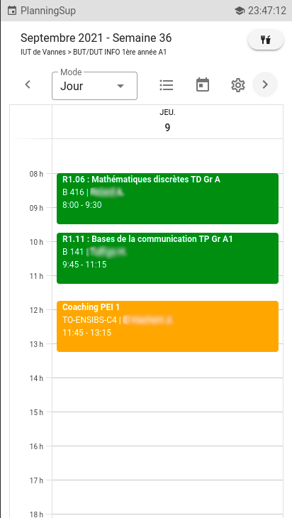
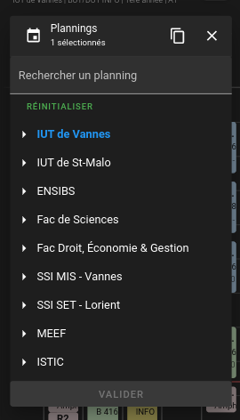
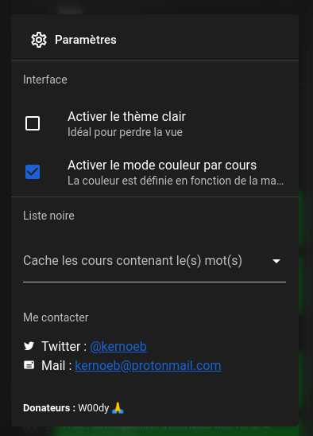

<h1 align="center">
  <br>
  <a href="https://planningsup.app"></a>
  <br>
  PlanningSup
  <br>
</h1>

<h4 align="center">Un planning universitaire moderne réalisé par <a href="https://github.com/kernoeb" target="_blank">@kernoeb</a>.</h4>

<p align="center">
  <a href="https://github.com/kernoeb/PlanningSup/releases"></a>
  <!--
  <a href="https://betteruptime.com/?utm_source=status_badge">
    
  </a>
  -->
  <a href="https://deepscan.io/dashboard#view=project&tid=12018&pid=22093&bid=649211">
    
  </a>
</p>



## Fonctionnalités

- **Hors connexion** / installation en mode **PWA**
- Couleurs par catégorie *ou* par UE (Amphi, TD, TP, etc.) et choix des couleurs
- Mode jour / semaine / mois
- Zoom sur un cours
- Changement d'université / spécialité (cookie ou paramètre)
- Thème clair / thème sombre (cookie)
- Sélection **multiple** de plannings
- Actualisation du planning au chargement, au focus de la page et toutes les 2 minutes
- Liste de bloquage (cacher un cours)

> N'hésitez pas à créer une issue ou à me contacter sur [Telegram](https://t.me/kernoeb) (@kernoeb) ou Discord (kernoeb#7737) pour plus d'infos, pour me notifier d'une erreur ou proposer une fonctionnalité !


## Ajouter une spécialité ou une université

Si votre université (ou autre !) accepte le format `ICS` pour les calendriers, n'hésitez pas à faire une Pull Request en modifiant le fichier `assets/plannings.json` :)

> Avec [@matissePe](https://github.com/matissePe) et [@ShockedPlot7560](https://github.com/ShockedPlot7560), nous avons réalisé un **script** pour générer automatiquement le JSON dans la bonne forme, situé dans le dossier `scripts` du projet.  

## Comment ça marche ?

Le planning est développé en [Nuxt.js](https://nuxtjs.org/). Tout est dockerisé !

#### APIs :

- `/api/calendars` : fetch côté serveur du calendrier au format `.ics`, puis conversion au format JSON
- `/api/urls` (en cache côté serveur) : `./assets/plannings.json`, mais sans les URLs

Chaque planning est sauvegardé dans une base de données `MongoDB`, à un intervalle régulier. En cas de lenteur ou de coupure serveur (côté université), le dernier planning enregistré est alors utilisé.

## Captures (mobile)


<br>

<br>

## Installation

### Docker

Créez un fichier `.env` avec les variables suivantes :  

> Remplacez la variable 'SESSION_SECRET' avec une valeur aléatoire et **unique**.

```
SESSION_SECRET=secret
MONGODB_URL=mongodb:27017
TZ=Europe/Paris
```

Copiez le fichier `docker-compose.yml` et lancez `docker-compose pull && docker-compose up -d --remove-orphans` pour démarrer les conteneurs.

Pull automatique (toutes les 30 minutes) du docker-compose et démarrage :
```
*/30 * * * * cd /path/to/dockercompose/ && docker-compose pull && docker-compose up -d --remove-orphans
```

## Développement

### Nécessaire

- [Node.js](https://github.com/nodejs/node) 20.X : Installation via [nvm](https://github.com/nvm-sh/nvm)

### Commandes utiles

Lancement en local : 

- Modifier le fichier `.env` avec `MONGODB_URL=localhost:27017`
- `npm run dev` (pour ne pas utiliser Mongo et ne pas lancer les backups)

> For MacOS M1, you can use `npm run dev:darwin-arm64`

## Donateurs

- [Ewennn](https://github.com/Ewennnn) (merci️, le goat)
- [W00dy](https://github.com/0xW00dy)
- [Rick](https://github.com/rick-gnous)
- [Lahgolz](https://twitter.com/lahgolzmiin)
- [Dyskal](https://github.com/Dyskal)
- [Mimipepin](https://github.com/mimipepin)
- [Atao](https://github.com/Ataaoo)
- [PandAmiral](https://github.com/PandAmiral)
- [ShockedPlot](https://github.com/ShockedPlot7560)
- [BatLeDev](https://github.com/BatLeDev)
- Louanne M.
- RidzArt
- [EDM115](https://github.com/EDM115)

(merci à vous ! ❤️)

Si vous souhaitez me faire un petit don :

[](https://www.paypal.com/paypalme/kernoeb)

[](https://www.buymeacoffee.com/kernoeb)
