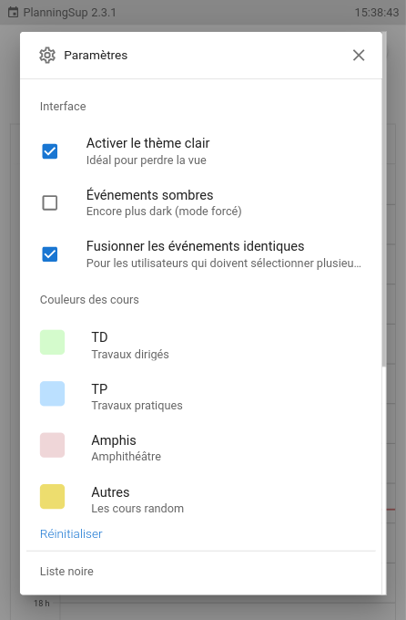

# planningiut

Un planning universitaire sympathique réalisé par @kernoeb.  

### Ajouter une formation

Faîtes une pull request en modifiant le fichier `static/url.json`, en respectant à la lettre le schéma déjà présent! :)

### Captures :

  

 

 

 

 

 

